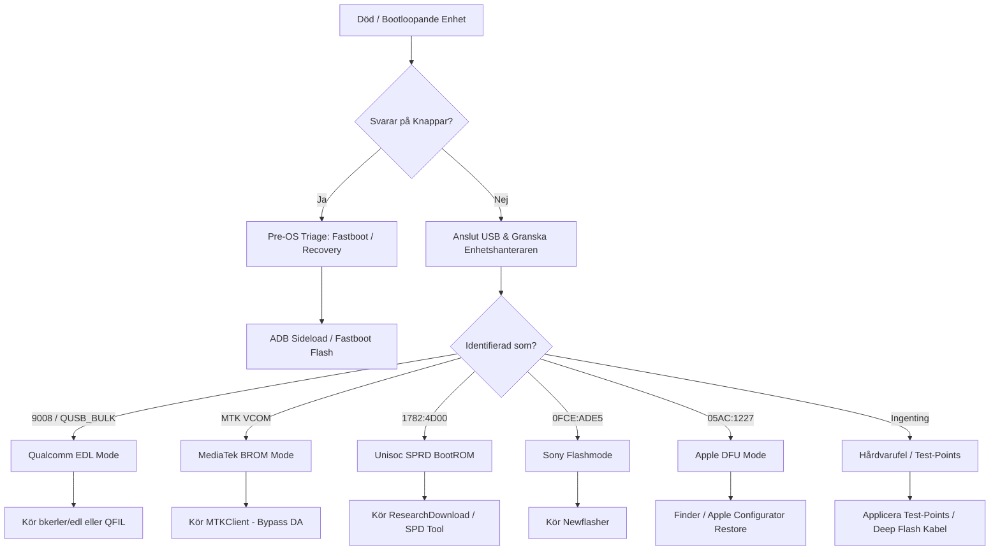

# 🌌 SoC Deep Atlas — Unified Master Architecture

> **Lanfear Diagnostics: Android Journal v2026.2**
>
> En personlig handbok för avancerad felsökning, reparation, diagnostik, dataåterställning och upplåsning av Android-enheter och mobila SoC-plattformar.
>
> Version 2026.2 | Av Lanfear | Stockholm
>
> Endast för legitim reparation av egna enheter. All användning sker på egen risk. Respektera lagar kring IMEI, FRP och bootloader.

---

## 📑 Innehållsförteckning

| Sektion | Innehåll |
|---------|----------|
| **01** | Inledning & användning — syfte, varningar, risker, juridik |
| **Tier 0** | Foundations Atlas — kisel, minne, Android-grunder, PMIC |
| **Tier 1 Vol 1** | Qualcomm Snapdragon Deep Atlas — EDL, Diag, XBL, QSEE |
| **Tier 1 Vol 2** | MediaTek Deep Atlas — BROM, Preloader, SLA/DAA, mtkclient |
| **Tier 1 Vol 3** | Samsung Exynos Deep Atlas — Knox, Odin, EUB, Upload Mode |
| **Tier 1 Vol 4** | Google Tensor Deep Atlas — Titan M2, Weaver, GKI |
| **Tier 1 Vol 5** | HiSilicon Kirin Deep Atlas — SecureROM, iTrustee, USB COM 1.0 |
| **Tier 1 Vol 6** | Unisoc / Spreadtrum Deep Atlas — FDL, SC9863A1, SPRD Diag |
| **Tier 1 Vol 7** | Rockchip Deep Atlas — MaskROM, RKNN, TrustOS |
| **Tier 1 Vol 8** | Allwinner Deep Atlas — FEL, TOC0/TOC1, SID |
| **Tier 1 Vol 9** | Apple Silicon Mobile Atlas — DFU, SEP, Purple Mode, checkm8 |
| **Tier 1 Vol 10** | Nokia / HMD Global — C32 TA-1534, SPRD flash, FRP |
| **Tier 1 Vol 11** | Sony Xperia Deep Atlas — XZ2 H8266, Flashmode, Newflasher |
| **Tier 1 Vol 12** | Andra SoC-familjer — Intel, Nvidia Tegra, Snapdragon Wear |
| **Tier 2** | Universal Boot Architecture — BootROM → Kernel |
| **Tier 3** | Security Architecture — Secure Boot, AVB, RPMB, anti-rollback |
| **Tier 4** | Storage Architecture — eMMC, UFS, FTL, RPMB, filesystems |
| **Tier 5** | Communications Architecture — USB, ADB, Fastboot, S1, SPRD |
| **Tier 6** | Hardware Forensics — PMIC, UART, glitching, chip-off, ISP |
| **Tier 7** | AI Diagnostics Architecture — agenter, RAG, fault trees |
| **Tier 8** | Real-World Playbooks — FRP, flash, triage, secret codes |
| **Tier 9** | Lanfear Platform Atlas — device discovery, connectivity |
| **Appendix A** | Verktygsmatris (per läge / plattform / pris) |
| **Appendix B** | Drivrutinsguide (9008, VCOM, SPRD, Sony S1, Zadig) |
| **Appendix C** | Test Point-resurser |
| **Appendix D** | Auto-Detection Script (bash) |
| **Appendix E** | Glossary — nyckelbegrepp |

---

## 01 — Inledning & användning

### Syfte

Denna atlas kartlägger lågnivålägen i mobila SoC:er (System-on-Chip) för alla större tillverkare: Qualcomm, MediaTek, Samsung/Exynos, Google Tensor, HiSilicon Kirin, Unisoc/Spreadtrum, Rockchip, Allwinner och Apple. Den täcker även enhetsspecifika volymer för Nokia/HMD, Sony Xperia och övriga SoC-familjer.

Atlasen täcker universella gränssnitt (Fastboot, ADB, Recovery) såväl som kretsspecifika lägen (EDL, BROM, DFU, FEL, MaskROM). För varje läge anges dess funktion, protokoll, verktyg samt in- och utgångar.

Strukturen är organiserad efter **abstraktionslager** (inte tillverkare) för att eliminera duplicering och möjliggöra enkel navigering för både människor och AI-agenter.

### Hur du använder atlasen

- **Ny på området?** Börja med Tier 0 (Foundations) för att förstå kiselnivån, sedan Tier 2 (Boot) och Tier 5 (Communications).
- **Arbetar med en specifik enhet?** Gå direkt till rätt volym i Tier 1.
- **Behöver felsöka en hårdvaruskada?** Se Tier 6 (Hardware Forensics).
- **Bygger ett automationsverktyg?** Studera Tier 7 (AI Diagnostics) och Tier 9 (Lanfear Platform).
- **Vill ha snabba steg-för-steg?** Gå till Tier 8 (Real-World Playbooks).
- **Behöver snabbt identifiera ett USB-läge?** Se Appendix D (Auto-Detection Script).

### Viktiga varningar, risker & juridik

> ⚠️ **Lågnivååtgärder kan permanent bricka enheten, radera data, trigga Knox-bit (Samsung), eller ogiltigförklara garanti.**

- **Alltid:** Ha backup av originalfirmware, bootloader och partitionstabell innan du börjar.
- **Aldrig** ändra IMEI på enheter som inte är dina eller utan giltigt skäl — det är olagligt i de flesta länder.
- **FRP-bypass:** Används legitimt för att återställa egna enheter efter glömt Google-konto. Många metoder är patchade i nyare Android-versioner.
- **Test Points & Chip-off:** Kräver precision. Fel kan förstöra moderkortet.
- **Moderna enheter (2025–2026):** Allt fler har anti-rollback, starkare Secure Boot och autentisering (SLA/DA på MTK, Knox på Samsung). Metoder blir snabbt föråldrade.
- **Rollback & alternativ:** Om ett sätt misslyckas, prova säkra alternativ först. Starta via fria recovery-verktyg (TWRP/OrangeFox) för nödbackup innan flash.
- **Drivrutiner:** Använd verifierade drivrutiner från tillverkaren eller välkända källor. Kör aldrig okända `.exe` som påstås vara officiella verktyg utan kontroll.
- **Rekommendation:** Börja alltid med mjukaste metoden (ADB → Fastboot → Recovery → low-level). Dokumentera varje steg.

> 💡 *Kunskap är makt — men dokumenterad kunskap är en superkraft. Spara alltid alla originalfiler per modell i en strukturerad mapp.*

---

# 📚 TIER 0 — Foundations Atlas

Grundläggande kunskap som gäller för alla SoC:er oavsett tillverkare.

## Volume 0A — Semiconductor Fundamentals

### Silicon
- **CMOS** — Complementary Metal-Oxide-Semiconductor, basen i alla moderna processorer
- **FinFET** — 3D-transistorer (16nm och mindre)
- **GAAFET** — Gate-All-Around (3nm och mindre)
- **DVFS** — Dynamic Voltage and Frequency Scaling
- **Power Domains** — uppdelning av chippet i oberoende strömområden
- **Clock Trees / PLL** — faslåsta slingor för klockdistribution

### Memory
- **SRAM** — statiskt RAM, används i cache
- **DRAM** — dynamiskt RAM
- **LPDDR3 / LPDDR4 / LPDDR5 / LPDDR5X** — mobil-DRAM-generationer

### Storage
- **NAND Flash** — SLC (1 bit/cell), MLC (2), TLC (3), QLC (4)
- **eMMC** — Embedded Multi-Media Controller
- **UFS** — Universal Flash Storage (2.0, 2.1, 2.2, 3.0, 3.1, 4.0)

### Interfaces
- **SPI** — Serial Peripheral Interface
- **I2C** — Inter-Integrated Circuit
- **UART** — Universal Asynchronous Receiver-Transmitter
- **USB** — Universal Serial Bus (2.0, 3.0, 3.1, 3.2, USB-C)
- **PCIe** — Peripheral Component Interconnect Express
- **JTAG / SWD** — debug-gränssnitt

### Secure Elements
- **OTP** — One-Time Programmable memory
- **eFuses** — elektriskt programmerbara säkringar
- **PUF** — Physically Unclonable Function
- **Secure Enclave / Titan M** — dedikerade säkerhetschip

### PMIC Fundamentals
- **Rails** — spänningsskenor (`PP_BAT`, `VPH_PWR`, `VREG_*`)
- **Sequencing** — startordning för spänningar vid uppstart
- **Power Domains** — oberoende strömförsörjning per block
- **Buck / Boost Regulators** — DC/DC-omvandlare (step-down / step-up)
- **LDO** — Low-Dropout linear regulators (för brus-känsliga block som RF/PLL)
- **Overcurrent Protection** — automatisk avbrott vid kortslutning (OCP)
- **Thermal Shutdown** — automatisk avstängning vid överhettning (TSD)
- **Fuel Gauge** — batterikapacitetsmätning (coulomb counter)
- **Battery Fuel Gauge IC** — separat chip för exakt kapacitetsläsning (Maxim, TI)
- PMIC Families per SoC (Qualcomm Atlas/Wonder, MediaTek PMIC, Samsung S2MPG, Google PMIC)

#### PMIC Boot Sequencing
Vid uppstart sekvenserar PMIC:n spänningsskenor i en specifik ordning:
1. `PP_BAT` / `VPH_PWR` — huvudström från batteri
2. `VDD_CORE` — processorkärna (0.6–1.2V, DVFS-styrd)
3. `VDD_MEM` — DRAM (1.1V LPDDR4/5)
4. `VDD_Q` — IO-ström (1.8V/3.3V)
5. `VDD_RF` — basband/RF (bruskänsligt)
6. `RESET_N` — släpp processor-reset när spänningar stabila

> 💡 *Fel i PMIC-sekvensering är en vanlig orsak till boot loops. Mät med oscilloskop att alla skenor når nominell spänning innan RESET_N släpps.*

#### PMIC Diagnostics
- Mät `VPH_PWR` (batterispänning, ~3.7–4.4V)
- Mät `VDD_CORE` (processorkärna, ~0.6–1.2V)
- Kontrollera OCP/TSD-statusregister
- Verifiera Fuel Gauge-kommunikation (I2C)

---

## Volume 0B — Android Platform Fundamentals

### Boot Flow
```
BootROM → PBL/XBL → ABL → Bootloader → Linux Kernel → Init → Zygote → System Server
```

### Partitions
| Partition | Funktion |
|-----------|----------|
| `boot` | Kernel + ramdisk |
| `init_boot` | Init-ramdisk (Android 13+) |
| `vendor_boot` | Vendor-ramdisk (Android 10+) |
| `super` | Dynamisk behållare för system, vendor, product |
| `vbmeta` | Verified Boot metadata |
| `userdata` | Användardata (krypterad) |
| `persist` | Beständiga OEM-inställningar |
| `misc` | Boot-kontext |
| `frp` | Factory Reset Protection (Google-lås) |

### Security
- **SELinux** — Mandatory Access Control, policy-baserad åtkomstkontroll
- **AVB** — Android Verified Boot (vbmeta, dm-verity, chained partitions)
- **Keystore** — nyckelhantering i hårdvara (Hardware-backed Keymaster)
- **Gatekeeper** — lösenordsautentisering, rate-limiting
- **Weaver** — hårdvarubaserad lagring av autentiseringsdata (Tensor, Pixel)
- **StrongBox** — dedikerad säker processor för nyckelhantering

### Updates
- **A/B** — slot-baserade uppdateringar (seamless)
- **Virtual A/B** — COW-baserade uppdateringar (copy-on-write)
- **Dynamic Partitions** — logiska partitioner i `super`
- **GKI** — Generic Kernel Image (Android 12+)

### Android Internals
- **Vendor Interface (VINTF)** — kompatibilitetsmatris mellan HAL och kernel
- **Recovery Architecture** — stock recovery, sideload, fastbootd
- **Fastboot / Fastbootd** — bootloader-läge respektive userspace för dynamiska partitioner

---

# 📱 TIER 1 — Silicon Family Atlases

## Volume 1 — Qualcomm Snapdragon Deep Atlas

### CPU Evolution
| Arkitektur | Generation | Process |
|-----------|------------|---------|
| Scorpion | Snapdragon S1–S4 | 45nm–28nm |
| Krait | Snapdragon 400/600/800 | 28nm |
| Kryo | Snapdragon 820/835/845/855/865 | 14nm–7nm |
| Kryo (ARM) | Snapdragon 888/8 Gen 1/8+ Gen 1 | 5nm–4nm |
| Oryon | Snapdragon 8 Gen 2/3/4 | 4nm–3nm |

### GPU Evolution
- Adreno 2xx–7xx generationer
- Adreno GPU stöder Vulkan, OpenGLES, OpenCL

### DSP
- **Hexagon** — DSP-processor
- **HVX** — Hexagon Vector Extensions
- **AI Engine** — maskininlärningsacceleration (Hexagon + Adreno + Kryo)

### ISP
- **Spectra** — Image Signal Processor (kamera-pipeline)

### NPU
- Qualcomm AI Engine (Hexagon NPU i nyare generationer)

### Security — Boot Chain
| Steg | Funktion | Beskrivning |
|------|----------|-------------|
| **PBL** | Primary Boot Loader | Först i BootROM. Validerar XBL-signatur. |
| **XBL** | eXtensible Boot Loader | Validerar ABL. Initierar DRAM, UFS, USB. |
| **XBL_SEC** | XBL Security | Säkerhetskontroll, fuse-läsning, anti-rollback. |
| **ABL** | Android Boot Loader | Validerar boot.img. Visar bootloader-lås-status. |
| **TrustZone / QSEE** | Qualcomm Secure Execution Environment | Körs parallellt, hanterar DRM, lösenord, nycklar. |
| **RPMB** | Replay Protected Memory Block | HMAC-skyddad lagring i eMMC/UFS. |
| **AVB integration** | Android Verified Boot | ABL validerar vbmeta → boot → dtbo. |

### Recovery — EDL Mode (Emergency Download Mode)

**Protokoll:** Qualcomm HS-USB QDLoader 9008 (VID 0x05C6, PID 0x9008)

EDL är det primära lågnivåläget i Qualcomm Boot ROM. Det tvingar telefonen att agera som USB-slav och ger full åtkomst till eMMC/UFS.

#### Hur man når EDL (4 metoder)
1. **Mjukvara:** `adb reboot edl` eller `fastboot oem edl` (om tillgängligt)
2. **EDL-kabel / Deep Flash Cable:** Kortsluter D+ till GND via 10kΩ-motstånd
3. **Test Points:** På moderkortet — kräver fysiskt ingrepp
4. **Knappkombination:** Ofta Vol Down + Power (sällsynt på nyare enheter)

#### Protokollstack
```
Sahara ← laddar Firehose-programmerare till RAM
Firehose ← läser/skriver partitioner via XML-kommandon
```

#### Sahara-protokollet
Sahara är det första protokollet som körs i EDL. Processorn skickar en hello-paket och väntar på att datorn svarar med en signerad programmerare (firehose .elf-fil) som laddas till RAM.

```
Enhet → Host:  HELLO (capability, max_packet)
Host → Enhet:  HELLO_RESPONSE (mode, status)
Enhet → Host:  READ_DATA (offset, length)  ← begär firehose-programmerare
Host → Enhet:  DATA (firehose.elf)
Enhet → Host:  DONE / END_OF_IMAGE
```

#### Firehose-protokollet
När firehose-programmeraren laddats till RAM körs den och exponerar ett XML-baserat protokoll för partition access:

```xml
<?xml version="1.0" ?>
<data>
  <configure MemoryName="ufs" ZLPAwareHost="1" />
  <read_sectors start_sector="0" num_partition_sectors="64" ... />
  <program start_sector="0" num_partition_sectors="1024" ... />
  <power DelayInSec="2" Value="reset" />
</data>
```

Vanliga firehose-kommandon:
- `printgpt` — läs GPT-partitionstabell
- `w z --partition=userdata` — skriv nollor till partition
- `rf dump.bin` — läs hela flashminnet
- `pe <partition>` — radera partition

#### Firehose-programmerare per SoC
| SoC | Programmerare |
|-----|---------------|
| SDM845 | `prog_ufs_firehose_sm8150.elf` |
| SM8250 | `prog_ufs_firehose_sm8250.elf` |
| SM8350 | `prog_ufs_firehose_sm8350.elf` |
| MSM8917 | `prog_emmc_firehose_8917.mbn` |

> 💡 *Spara alltid original firehose/programmer-filer per modell. Vissa loaders tillåter bypass av vissa säkerhetskontroller. edl (bkerler) innehåller en stor databas med gratis firehose-filer.*

#### Verktyg
| Verktyg | Plattform | Kostnad | Funktion |
|---------|-----------|---------|----------|
| **edl** (bkerler) | Python | Gratis / Open Source | Partition dump/flash, FRP-bypass, firehose-databas |
| **QFIL** (QPST) | Windows | Gratis (läckt OEM) | Full firmware-flash |
| **QDL** | Linux | Gratis / Open Source | Bootrom-kommunikation (Björn Andersson) |
| **QPST / QXDM** | Windows | Gratis (läckt) | Diag Mode, NVRAM/QCN-backup |
| **EFS Professional** | Windows | Gratis | NVRAM/IMEI-hantering |

#### Tips & Tricks
> Spara alltid original firehose/programmer-filer per modell. Vissa loaders tillåter bypass av vissa säkerhetskontroller.
>
> Om `adb reboot edl` blockeras av tillverkaren, använd en Deep Flash Cable (kortslut D+ och GND med 10kΩ) för att tvinga fram läget hårdvarumässigt.

### Diagnostic Mode (Diag)
Seriellt läge över USB (port 9006/901D) för:
- **QPST/QXDM** — radiokalibrering
- **NVRAM** — läsning/skrivning (IMEI, basband)
- **RF-tester** — signalvalidering
- **QCN-backup** — kvalcomm kalibreringsfil

Aktiveras via `setprop persist.usb.eng=1` eller USB-inställningar.

### Diagnostic Ports
- **Crashdump** — vid kernel panic, dumpar RAM över USB
- **Ramdump** — full minnesdump för analys
- **Minidump** — komprimerad RAM-dump
- **QXDM** — Qualcomm eXtensible Diagnostic Monitor
- **QCAT** — Qualcomm Capture Analysis Tool

### Hardware
- **PMIC Families** — strömhanteringskretsar (Atlas, Wonder)
- **UFS Families** — UFS-kontrollervarianter
- **UART Maps** — debug-UART-pins per chip

---

## Volume 2 — MediaTek Deep Atlas

### Boot Chain
| Steg | Funktion | Beskrivning |
|------|----------|-------------|
| **BROM** | Boot ROM | Hårdkodat i kislet. Alltid tillgängligt så länge ström finns. Kan inte raderas. |
| **Preloader** | Första mjukvaruboot | Ligger på flashminnet. Initierar DRAM och USB-VCOM. |
| **LK / LK2** | Little Kernel | Bootloader för Android, validerar boot.img. |
| **ATF** | ARM Trusted Firmware | Secure Monitor (EL3). |

### Security
- **SLA** — Serial Link Authentication (autentisering av USB-anslutning till BROM)
- **DAA** — Download Agent Authentication (kräver signatur på DA)
- **SBC** — Secure Boot Chain (signaturverifiering av boot-steg)
- **Root Cert Chain** — rotcertifikat för signaturverifiering
- **BROM Security Model** — skydd mot obehörig dump via SLA/DAA

### Recovery — BROM Mode

BROM är det absolut lägsta hårdvaruläget på MediaTek-enheter. Det är hårdkodat i processorns krets och kan inte raderas.

#### Hur man når BROM
1. Håll inne båda Volym-knapparna före USB-anslutning
2. Test Points på moderkortet (mycket vanligt)
3. Kortslutning av specifik TP till GND

#### Verktyg
| Verktyg | Plattform | Kostnad | Funktion |
|---------|-----------|---------|----------|
| **mtkclient** (bkerler) | Python | Gratis / Open Source | Bypassar SLA/DA-autentisering, dump, flash, unlock bootloader |
| **SP Flash Tool** | Windows | Gratis (officiell) | Flashing av scatter-firmware |
| **BROM Bypass Script** | Python | Gratis | Injektion av payload för att stänga av DA-autentisering |
| **mtk-su** | Android | Gratis | Root-exploit på äldre MTK-enheter |

#### Tips & Tricks
> Håll inne båda Volym-knapparna på en död MTK-enhet innan du ansluter USB-kabeln för att fånga BROM-läget innan Preloadern hinner ta över.
>
> Kombinera SP Flash Tool med ett separat BROM-bypass-skript för att slippa kravet på tillverkarspecifika inloggningskonton.
>
> mtkclient utnyttjar hårdvarusårbarheter (BROM bypass) för att stänga av säkerhetskontroller på sekunder — helt konkurrerar ut betalboxar.

### Preloader Mode
Steget efter BROM, ligger på flashminnet. Initierar USB VCOM-porten. Används vid standardflashning när minnet inte är korrupt.

### Diagnostic Modes
- **Meta Mode** — Engineering Test Mode
- **Factory Mode** — produktionstestning
- **AT Mode** — AT-kommandon över COM-port
- **Modem Logs** — basbandsloggning

### Hardware
- **PMIC Atlas** — strömhantering per chipset
- **DRAM Init** — DRAM-initialiseringsparametrar

---

## Volume 3 — Samsung Exynos Deep Atlas

### Boot Chain
| Steg | Funktion |
|------|----------|
| **BL1** | Första i BootROM. Validerar BL2. |
| **BL2** | Laddar och validerar EL3-monitor och BL33 (UEFI/bootloader). |
| **EL3 Monitor** | Secure Monitor. |
| **SBOOT** | Samsung Bootloader — validerar kernel/recovery. |

### Security — Knox
- **Knox Guard** — hårdvarubaserad säkerhetsplattform
- **RKP** — Real-time Kernel Protection
- **DEFEX** — Device Feature Extensions
- **TIMA** — TrustZone Integrity Measurement Architecture
- **VaultKeeper** — nyckelhantering
- **Knox Trip (e-fuse 0x1)** — bränns vid inofficiell firmware, permanent

> ⚠️ Knox "bränner" en e-fuse fysiskt (Trip 0x1) när inofficiell firmware flashas. På vissa äldre Exynos-chip kunde denna fuse-läsning luras vid uppstart genom spänningsmanipulation — men ej på moderna enheter.

### Recovery — Download / Odin Mode

Samsungs motsvarighet till EDL. Använder **Thor-protokollet** över USB.

#### Hur man når Odin Mode
1. Stäng av enheten
2. Håll Volym Ner + Volym Upp + anslut USB
3. Tryck Volym Upp på varningsskärmen
4. Nyare modeller: aktivera Maintenance Mode i inställningar först

### Exynos USB Booting (EUB)
Om SBOOT är korrupt faller Exynos-chippet tillbaka till EUB. Datorn identifierar den som `ExynosXXXX`.

### Upload Mode (Kernel Panic)
Grön/röd skärm med minnesadresser. Tvingas fram genom att skicka specifika fel till modemet, vilket dumpar hela RAM (inklusive krypteringsnycklar i klartext) via USB (**CP RAMDUMP**).

#### Verktyg
| Verktyg | Plattform | Kostnad | Funktion |
|---------|-----------|---------|----------|
| **Odin** | Windows | Gratis (läckt) | Samsung firmware-flash (.tar.md5) |
| **Heimdall** | Cross-platform | Gratis / Open Source | Open Source Odin-klon |
| **SamFw Tool** | Windows | Gratis GUI | FRP-bypass, regionändring, fabriksåterställning |
| **Loke** | Linux | Open Source | Thor-protokoll-implementation |

### Diagnostic Codes (Dialer)
| Kod | Funktion |
|-----|----------|
| `*#0*#` | Hardware Diagnostic Menu (LCD, RGB, Touch, Sensor Hub) — ultimata testmenyn |
| `*#9900#` | SysDump Menu (Kmsg, CP Ramdump, dumpstate, logcat, Fast Dormancy) |
| `*#0808#` | USB Settings (MTP, ADB, RNDIS, DM+MODEM — aktiverar Diag-portar) |
| `*#0228#` | Battery Status & ADC Reading |
| `*#22087#` | Hidden AP/CP Bootloader check |
| `*#2663#` | Touchscreen & Sensor Firmware Update (i2c flash) |
| `*#06#` | IMEI |
| `*#011#` | PLK Service Mode |
| `*#0283#` | Loopback Test |
| `*#1234#` | Firmware Version |
| `*#2683662#` | Advanced Audio/Engineering Mode |
| `*#34971539#` | Camera Firmware |
| `*#7353#` | Quick Test Menu |
| `*#9090#` | Diagnostic Config |

#### Tips & Tricks
> Samsungs *#0808# är den snabbaste vägen att aktivera Diag + ADB utan root. Byt USB-läge till "DM+MODEM+Adb" för att exponera både Diag-port och ADB samtidigt.
>
> Använd HOME_CSC i Odin för att behålla data; CSC för total wipe.

---

## Volume 4 — Google Tensor Deep Atlas

### Security
- **Titan M** — första generationens säkerhetschip
- **Titan M2** — andra generationen (Pixel 6+). UART-pads på baksidan av moderkortet.
- **Weaver** — hårdvarubaserad lagring av autentiseringsdata
- **AVB** — Android Verified Boot
- **Rollback Protection** — förhindrar nedgradering av firmware
- **Tensor Security Core** — dedikerad säkerhetsprocessor

### Android Integration
- **GKI** — Generic Kernel Image
- **vendor_boot / init_boot** — Android 12+ strategi för att separera ramdisks
- **Tensor Security Core** — hanterar boot-attestation

### AI Hardware
- **TPU** — Tensor Processing Unit
- **ISP** — Image Signal Processor
- **Edge AI** — on-device maskininlärning

### Recovery
- Rescue Mode + Fastboot via Android Flash Tool (WebUSB i Chrome)
- Begränsad low-level jämfört med Qualcomm/MTK
- **Titan M2 UART-glitch:** injicera negativ spänningspuls på reset-linjen under uppstart för att få bootloader-shell

> 🔬 *Titan M2 (säkerhetschippet i Pixels) har UART-pads på baksidan av moderkortet. Genom att injicera en negativ spänningspuls (glitch) på dess reset-linje under uppstart droppar chippet in i en bootloader-shell där man kan extrahera Weaver-tokens (används för dekryptering av userdata). Avancerat och forensiskt.*

### Secret Codes (Pixel)
| Kod | Funktion |
|-----|----------|
| `*#*#4636#*#*` | Testing Menu (radio, batteri, bandlåsning — tvinga "NR/LTE Only") |
| `*#*#759#*#*` | RLZ Debug UI (OEM-spårning, partner-bookmarks) |
| `*#*#225#*#*` | Calendar Storage Debug (dold databas-diagnostik) |

---

## Volume 5 — HiSilicon Kirin Deep Atlas

### Security
- **SecureROM** — hårdkodad boot ROM
- **iTrustee** — TrustZone OS
- **TrustZone** — ARM TrustZone

### Boot Fail Modes
Om primära bootloader (xloader) är korrupt faller Kirin tillbaka till USB COM 1.0-läget.

### Recovery
- **eRecovery** — firmware-nedladdning direkt från Huaweis servrar via HiSuite
- **USB COM 1.0** — djupt hårdvaruläge för Kirin-processorer

#### Hur man når USB COM 1.0
- Extremt obfuskerade Test Points under plåtsköldar
- Kräver specialmodifierad kabel med 10kΩ-motstånd mellan D+ och GND
- Kringgår HarmonyOS/EMUI Secure Boot totalt
- Tillåter skrivning av xloader och fastboot direkt till UFS

### Modem
- **Balong** — HiSilicons basbandsprocessor

> ⚠️ Kirin-enheter (Huawei/Honor) är bland de svåraste att reparera 2026. Gratisverktyg saknas i stort sett — kräver betalda boxar eller community-lösningar.

---

## Volume 6 — Unisoc / Spreadtrum Deep Atlas

> 🎯 **MAJOR EXPANSION** — Denna volym utökas kraftigt för att täcka budgetenheter (Nokia C32, Infinix, Tecno, Itel) som använder Unisoc/Spreadtrum-SoC:er.

### Boot
| Steg | Funktion | Beskrivning |
|------|----------|-------------|
| **BootROM** | Boot ROM | Motsvarighet till EDL/BROM. Hårdkodat i kisel. |
| **SPL Loader** | Secondary Program Loader | Laddar FDL-filer till RAM. |
| **FDL1** | Flash Download Loader 1 | Första laddaren, initierar minne och USB. |
| **FDL2** | Flash Download Loader 2 | Andra laddaren, ger partition access. |
| **Linux Kernel** | Kernel | Startar Android. |

### Security
- **Secure Boot** — signaturverifiering av laddare
- **SPL Loader signatures** — kontrollerar FDL-signaturer
- **Anti-rollback** — finns på nyare Unisoc-chip

### SPRDFamily Enum
Unisoc-chip identifieras via en familje-enum i protokollet:

| Familj | Beskrivning |
|--------|-------------|
| **IWHALE2** | Äldre Whale-arkitektur |
| **ISHARKL2** | Shark L2-arkitektur |
| **SHARKLJ1** | Shark LJ1 |
| **SHARKLE** | Shark LE |
| **PIKE2** | Pike2-arkitektur (entry-level) |
| **SHARKL3** | Shark L3 — t.ex. SC9863A1 (Nokia C32) |
| **SHARKL5** | Shark L5 |
| **SHARKL5PRO** | Shark L5 Pro |
| **ROC1** | Roc1-arkitektur |

### SC9863A1 (SHARKL3) — Nokia C32 TA-1534
- **SoC:** Unisoc SC9863A1 (SHARKL3-familj)
- **CPU:** Octa-core (2x1.6 GHz Cortex-A55 + 6x1.2 GHz Cortex-A55)
- **GPU:** Imagination PowerVR GE8322
- **OS:** Android 13 (Nokia C32 TA-1534)
- **USB:** VID 0x1782, PID 0x4D00 (SPRD BootROM)
- **Boot chain:** BootROM → FDL1 → FDL2 → Linux

#### Boot Chain Detail (SC9863A1)
```
1. Power-on → BootROM (SPRD) exekverar från kisel
2. BootROM läser eFuses → verifierar Secure Boot-status
3. BootROM väntar på FDL1 över USB (SPRD Upgrade Mode)
   eller laddar FDL1 från flashminne (normal boot)
4. FDL1 initierar DRAM + USB (COM-port)
5. FDL2 laddas till RAM → ger partition read/write
6. FDL2 laddar Linux Kernel från UFS
7. Kernel → Android 13
```

#### FDL Flash Flow
```
1. Enhet i BootROM (VID 1782, PID 4D00)
2. Skicka FDL1 till RAM → initierar DRAM + USB
3. Skicka FDL2 till RAM → ger partition access
4. Läs/skriv partitioner via .pac-firmware
5. Reboot
```

#### .pac Firmware Format
Unisoc använder `.pac`-filer (proprietary container) som innehåller:
- `FDL1` — Flash Download Loader 1
- `FDL2` — Flash Download Loader 2
- Partitioner (`boot.img`, `system.img`, `userdata.img`, etc.)
- `flash.xml` — partition map och version-info

ResearchDownload parsar .pac-filen och skickar FDL1/FDL2 + partitioner till enheten.

#### SPRD Diag Mode AT-kommandon
Vanliga AT-kommandon i SPRD Diag Mode:
- `AT+EGMR=1,7,"IMEI"` — skriv IMEI (slot 1)
- `AT+EGMR=1,10,"IMEI"` — skriv IMEI (slot 2)
- `AT+SPATCMD=?` — SPRD-specifika kommandon
- `AT+CFUN=1,1` — full reset

> ⚠️ *Ändring av IMEI är olagligt i de flesta länder. Använd endast för legitim reparation av egna enheter med trasig NVRAM.*

### Recovery — SPD Upgrade Mode
Protokollet kommunicerar över virtuella COM-portar med FDL1/FDL2-filer som skickas direkt till telefonens cache/RAM.

#### Hur man når SPD Upgrade Mode / BootROM
1. Håll Volym-knapparna medan USB ansluts
2. Test Points på moderkortet (längs kretskortets kant, nära USB)
3. Knappkombination varierar per modell

#### Verktyg
| Verktyg | Plattform | Funktion |
|---------|-----------|----------|
| **ResearchDownload** | Windows | Officiellt Unisoc-verktyg för .pac-firmware |
| **SPD Upgrade Tool** | Windows | Flashning av .pac-firmware |
| **SPD Flash Tool** | Windows | Alternativ flashverktyg |
| **SPD Diag Mode** | COM-port | AT-kommandon för IMEI, nätverkslås, baseband-fix |

### SPD Diag Mode (NEW)
Precis som hos Qualcomm tillåter Unisoc ett diagnostikläge via AT-kommandon över COM-port:
- **IMEI-reparation**
- **Nätverkslås-upplåsning**
- **Baseband-fix** ("Fix unknown baseband")
- **NVRAM-access** — kalibreringsdata

### USB
- **VID 0x1782** — Unisoc/Spreadtrum
- **PID 0x4D00** — SPRD BootROM / Upgrade Mode

### Factory Test Modes
- **PAC Format** — firmware-paketering (.pac-filer)
- **Factory Test Modes** — produktionstestning
- **Modem Architecture** — basbandsarkitektur för budgetenheter

#### Tips & Tricks
> Unisoc/SPD-enheter (Nokia C32, Infinix, Tecno, Itel) är ofta enkla att flasha och FRP-bypassa med ResearchDownload + .pac-firmware. De saknar ofta stark Secure Boot på budgetmodeller.

---

## Volume 7 — Rockchip Deep Atlas

### Boot
| Steg | Funktion |
|------|----------|
| **MaskROM** | Inbyggt recovery-läge i ROM. Aktiveras om ingen giltig bootloader finns. |
| **Loader** | Första mjukvaruladdaren |
| **MiniLoader** | Kompakt bootloader för firmware-uppdatering |

### Recovery — MaskROM Mode
Nås via test point eller specifik knappsekvens. Om ingen bootloader hittas skrivs firmware via RockUSB.

#### Verktyg
| Verktyg | Plattform | Funktion |
|---------|-----------|----------|
| **rkdeveloptool** | Cross-platform | Rockchip-verktyg för firmware |
| **AndroidTool** | Windows | Flashning av Rockchip-enheter |
| **xrock** | Linux | Open Source Rockchip-verktyg |

### Security
- **RKNN** — Rockchip Neural Network
- **TrustOS** — TrustZone OS
- **Loader Header Format** — signerad loader-struktur
- **Firmware Containers** — firmware-paketering

---

## Volume 8 — Allwinner Deep Atlas

### Boot
| Steg | Funktion |
|------|----------|
| **FEL** | FEL Mode (BootROM). USB-åtkomst vid hårdvaruproblem. |
| **Boot0** | Första bootloader |
| **Boot1** | Andra bootloadern |

### Recovery — FEL Mode
Lågnivå-USB-åtkomst för initial programmering och återställning.

#### Verktyg
| Verktyg | Funktion |
|---------|----------|
| **sunxi-fel** | Open Source-kommunikation med FEL |
| **sunxi-tools** | Verktygssvit för Allwinner |
| **PhoenixSuit** | Windows-flashverktyg |
| **LiveSuit** | Windows-flashverktyg (äldre) |

### Security
- **TOC0 / TOC1** — Table of Contents för secure boot
- **SID** — Security ID (e-fuses)
- **Secure Storage** — krypterad lagring
- **FEL internals** — BootROM-åtkomstprotokoll

---

## Volume 9 — Apple Silicon Mobile Atlas

### Boot Chain
| Steg | Funktion |
|------|----------|
| **SecureROM** | Hårdkodad BootROM, oföränderlig. |
| **LLB** | Low-Level Bootloader. |
| **iBoot** | Huvudbootloader för iOS/iPadOS. |
| **KernelCache** | Förkompilerad kernel + drivers. |

### Security
- **SEP** — Secure Enclave Processor
- **SEPROM** — SEP:s boot ROM
- **Effaceable Storage** — raderbart nyckellagringsområde
- **UID Key** — Unique ID, enhetsunik krypteringsnyckel

### Recovery — DFU Mode (Device Firmware Update)

DFU är motsvarigheten till EDL/BROM. Processorn väntar på att iTunes/Finder ska skicka iBSS/iBEC (bootloaders) över USB.

**USB:** VID 0x05AC, PID 0x1227

#### Hur man når DFU (iPhone 8+)
1. Tryck Volym Upp, tryck Volym Ner
2. Håll Sidoknapp tills skärmen blir svart
3. Håll Sidoknapp + Volym Ned i 5 sekunder
4. Släpp Sidoknapp, fortsätt håll Volym Ned i 10 sekunder
5. Skärmen förblir svart — datorn upptäcker DFU-enhet

#### Tips & Tricks
> På A11 och äldre är DFU-läget ingången för **checkm8** (hårdvaru-exploit). På nyare enheter (A15–A18, M-serien) används DCSD-kablar (Magico/Alex) för att läsa/skriva SysCFG (Wi-Fi MAC, SN, Board Data) via I2C/UART över Lightning/USB-C.

### Purple Mode / DCSD
Djupt testläge från fabriken för att redigera SysCFG-parametrar via I2C/UART. Kräver specialkablar (Magico/Alex).

### Diagnostics
- **Panic Logs** — kernel panic-loggning
- **Purple Mode** — fabrikstestläge
- **DCSD** — Device Configuration and Service Diagnostics

### Filesystems
- **APFS** — Apple File System
- **Data Protection Classes** — krypteringsnivåer per fil (Class A–D)

### Field Test Code
| Kod | Funktion |
|-----|----------|
| `*3001#12345#*` | Field Test Mode (RSRP, RSRQ, bandfrekvenser, cell-ID) |

---

## Volume 10 — Nokia / HMD Global Deep Atlas (NEW)

> 🎯 Fokuserar på Nokia C32 TA-1534 — en vanlig budgetenhet med Unisoc SC9863A1.

### Nokia C32 TA-1534 Specifikation
| Egenskap | Värde |
|----------|-------|
| **SoC** | Unisoc SC9863A1 (SHARKL3) |
| **CPU** | Octa-core (2x1.6 + 6x1.2 GHz Cortex-A55) |
| **GPU** | PowerVR GE8322 |
| **OS** | Android 13 |
| **USB BootROM** | VID 0x1782, PID 0x4D00 |

### Boot Chain
```
BootROM (SPRD) → FDL1 → FDL2 → Linux Kernel → Android 13
```

### SPD Upgrade Mode for Flashing
Använd ResearchDownload med .pac-firmware för full om-flashning.

### SPRD Diag Mode for IMEI/Baseband
AT-kommandon över COM-port för IMEI-reparation och baseband-fix.

### FRP Bypass via SPRD
1. Tvinga BootROM (test point eller knappkombination)
2. Flash FDL1 + FDL2 till RAM
3. Radera userdata-partitionen via FDL2
4. Reboot — FRP borttaget

### Test Points for Unisoc SC9863A1
- Längs kretskortets kant, nära USB-kontakten
- Ofta märkta eller tillgängliga utan att ta bort sköldar
- Verifiera med multimeter innan kortslutning

### Tools
| Verktyg | Funktion |
|---------|----------|
| **ResearchDownload** | .pac-firmware flashning |
| **SPD Upgrade Tool** | Alternativ flashverktyg |
| **SPD Diag Mode** | IMEI/baseband-reparation |

### Secret Codes for Nokia/HMD
| Kod | Funktion |
|-----|----------|
| `*#*#864#*#*` | Diagnostic Menu |
| `*#*#362#*#*` | Factory Data Reset (FDR) |
| `*#06#` | IMEI |

---

## Volume 11 — Sony Xperia Deep Atlas (NEW)

> 🎯 Fokuserar på Sony Xperia XZ2 H8266 (akari) — SDM845.

### Sony Xperia XZ2 H8266 (akari) Specifikation
| Egenskap | Värde |
|----------|-------|
| **SoC** | Qualcomm SDM845 (Snapdragon 845) |
| **Flashmode USB** | VID 0x0FCE, PID 0xADE5 |
| **Fastboot USB** | VID 0x0FCE, PID 0x0DDE |

### Boot Chain
```
PBL → XBL → ABL → Linux Kernel
```

### Flashmode (S1 Protocol)
Sony använder ett proprietärt **S1-protokoll** för flashmode. Detta är Sonys motsvarighet till EDL, men med eget transportlager.

**USB:** VID 0x0FCE, PID 0xADE5

### FRP Bypass Methods (4 metoder)

#### Method 1: ADB Google Account Removal (kräver USB debugging)
```bash
adb shell pm disable-user --user 0 com.google.android.gms
adb shell pm disable-user --user 0 com.google.android.gsf
adb reboot
```

#### Method 2: Fastboot FRP Erase (kräver upplåst bootloader)
```bash
fastboot erase FRP
fastboot reboot
```

#### Method 3: Newflasher Full Flash (med persistent wipe)
```bash
# Ladda ner XZ2 firmware (.sin/.ta-filer)
newflasher.exe -i firmware.txt
```

#### Method 4: EDL Test Point (hard brick recovery)
```bash
python edl.py w z --partition=frp
```

### DRM/TA Partition Backup
- **TA-partition** — innehåller DRM-nycklar (Bravia Engine, X-Reality)
- **Backup innan unlock:** `adb shell su -c dd if=/dev/block/bootdevice/by-name/TA of=/sdcard/TA_backup.img`
- **Restore efter relock:** flasha tillbaka TA-partitionen

### Secret Codes
| Kod | Funktion |
|-----|----------|
| `*#*#7378423#*#*` | Service Menu (bootloader-status, root-keys, DRM/TA-partition) |

### Tools
| Verktyg | Funktion |
|---------|----------|
| **Newflasher** | Open Source Sony-flashverktyg (S1-protokoll) |
| **Emma** | Sony PC Companion (officiell) |
| **XperiFirm** | Firmware-nedladdning |
| **Flashtool** | Community-flashverktyg (äldre) |

#### Tips & Tricks
> Verifiera alltid bootloader-status via `*#*#7378423#*#*` ("Bootloader unlock allowed: Yes/No") innan du försöker låsa upp.
>
> Backup alltid TA-partitionen innan bootloader-unlock — DRM-nycklar går förlorade vid unlock och kan inte återställas utan backup.

---

## Volume 12 — Other SoC Families (NEW)

### Intel (Atom)
- **Atom x3/x5/x7** — övergivna mobilplattformar (SoFIA)
- Användes i Asus Zenfone C, Lenovo
- Låg support 2026 — community-verktyg sällsynta

### Nvidia Tegra
- **Tegra 3/4/K1/X1** — användes i Nexus 9, Shield TV, Nintendo Switch
- **Shield devices** — recoverable via fastboot/ADB
- **Nintendo Switch** — har eget bootROM (RCM mode), exploited via "fusee-gelée"

### Qualcomm Snapdragon Wear
- Smartwatches (Wear OS) baserade på Snapdragon Wear 2100/3100/4100+/5100
- EDL möjligt men kräver test points bakom skärm
- Begränsad verktygssupport

---

# 🔐 TIER 2 — Universal Boot Architecture

Den viktigaste volymen i hela atlasen — förklarar boot-sekvensen oavsett SoC.

## BootROM
- **Immutable Code** — oföränderlig kod i kisel
- **ROM Vectors** — avbrottsvektorer
- **Fuse Reads** — kontroll av e-fuses
- Validerar nästa stegs signatur

## Stage 1
| SoC | BootROM |
|-----|---------|
| Qualcomm | PBL (Primary Boot Loader) |
| MediaTek | BROM |
| Samsung | BL1 |
| Apple | SecureROM |
| Unisoc | BootROM (SPRD) |
| Rockchip | MaskROM |
| Allwinner | FEL BootROM |

## Stage 2
| SoC | Stage 2 |
|-----|---------|
| Qualcomm | XBL (eXtensible Boot Loader) |
| MediaTek | Preloader |
| Samsung | BL2 |
| Apple | LLB |
| Unisoc | FDL1 |
| Rockchip | Loader |

## Stage 3
| SoC | Stage 3 |
|-----|---------|
| Qualcomm | ABL (Android Boot Loader) |
| MediaTek | LK / LK2 |
| Samsung | SBOOT |
| Apple | iBoot |
| Unisoc | FDL2 |

## Kernel
- **Linux Init** — kernel startup
- **Android Init** — init-processen i Android

## Comparison Table — Full Boot Chain
| SoC | Stage 1 | Stage 2 | Stage 3 | Low-level Mode |
|-----|---------|---------|---------|----------------|
| Qualcomm | PBL | XBL | ABL | EDL (9008) |
| MediaTek | BROM | Preloader | LK/LK2 | BROM |
| Samsung | BL1 | BL2 | SBOOT | Odin/EUB |
| Apple | SecureROM | LLB | iBoot | DFU |
| Unisoc | BootROM | FDL1 | FDL2 | SPD Upgrade |
| Rockchip | MaskROM | Loader | MiniLoader | MaskROM |
| Allwinner | FEL | Boot0 | Boot1 | FEL |

---

# 🔒 TIER 3 — Security Architecture

## Secure Boot per SoC

| SoC | Secure Boot-mekanism |
|-----|---------------------|
| **Qualcomm** | PBL → XBL → ABL, signaturkedja |
| **MediaTek** | SBC (Secure Boot Chain), SLA/DAA |
| **Samsung** | Knox Chain, RKP, DEFEX, TIMA |
| **Apple** | SecureROM → LLB → iBoot, signaturkedja |
| **Tensor** | Titan M/Titan M2, AVB, rollback protection |
| **Unisoc** | Secure Boot, SPL Loader signatures |
| **Kirin** | SecureROM, iTrustee |

## AVB (Android Verified Boot)
- **vbmeta** — Verified Boot metadata-partition
- **Rollback indexes** — förhindrar nedgradering
- **Chained partitions** — flera signerade partitioner i kedja
- **dm-verity** — block-nivå verifiering av systempartition

## TrustZone
| SoC | TrustZone OS |
|-----|-------------|
| Qualcomm | QSEE (Qualcomm Secure Execution Environment) |
| MediaTek | OPTEE |
| HiSilicon | iTrustee |
| Apple | Secure Enclave OS |
| Samsung | TIMA / Knox TEE |

## RPMB (Replay Protected Memory Block)
- **Key Provisioning** — etablering av RPMB-nyckel vid fabrik
- **Authentication** — HMAC-baserad autentisering mot eMMC/UFS
- **Write Counter** — monotonisk räknare förhindrar replay-attacker
- **Användning** — DRM-nycklar, Secure Boot-state, anti-rollback

## Anti-Rollback
- **eFuse-baserad** — Qualcomm, MediaTek (Xiaomi ARB)
- **RPMB-baserad** — nyare enheter
- **Titan M2** — hårdvaru-rollback protection i Pixel
- ⚠️ *Xiaomi's "Anti-Rollback" (ARB) ligger i TrustZone. Flashing av äldre firmware tegelstens-bricker telefonen hårt, men EDL kan fortfarande tvingas fram för att skriva en ARB-godkänd bootloader.*

---

# 💾 TIER 4 — Storage Architecture

## eMMC

### Physical
- Die Layout — minneschipets fysiska struktur
- CMD, CLK, D0–D7 — signallinjer

### Protocol
- **CMD** — kommandon (klass 1–10)
- **EXT_CSD** — Extended Card Specific Data (register för konfiguration)

### Diagnostics
- Health — återstående livslängd
- Wear — skrivslitage per area
- Bad Block Management — omflyttning av dåliga block
- Life Time Estimate — EXT_CSD field DEVICE_LIFE_TIME_EST_A/B

### eMMC Internals
- **Controller** — inbyggd mikrokontroller i eMMC-paketet
- **FTL** — Flash Translation Layer (logisk → fysisk mappning)
- **Wear Leveling** — jämnar ut skrivslitage över alla block
- **Garbage Collection** — frigör borttagna block (background)
- **ECC** — Error Correction Code (BCH, LDPC)
- **RPMB Partition** — Replay Protected Memory Block (HMAC-skyddad)
- **Boot Partitions** — eMMC har två dedikerade boot-partitioner (boot0/boot1)
- **User Area** — huvudsaklig datayta
- **Extended CSD** — konfigurationsregister (PARTITION_CONFIG, BOOT_BUS_CONDITIONS)

#### eMMC EXT_CSD-viktiga fält
| Fält | Funktion |
|------|----------|
| `BOOT_SIZE` | Storlek på boot-partitioner |
| `PARTITION_CONFIG` | Väljer aktiv partition (boot/user/RPMB) |
| `EXT_CSD_REV` | eMMC-specifikationsversion |
| `DEVICE_LIFE_TIME_EST_A/B` | Livslängdsuppskattning (SLC/MLC) |
| `PRE_EOL_INFO` | Närma sig end-of-life varning |
| `SECURITY_VERSION` | Anti-rollback-version |
| `CID` — Card ID | Unikt kort-ID |
| `CSD` — Card Specific Data | Grundläggande konfiguration |

### UFS

### Layers
- **UniPro** — Unified Protocol (transportlager)
- **M-PHY** — fysiskt lager (seriell länk, upp till 11.6 Gbps per lane)
- **UTP** — UFS Transport Protocol
- **UCD** — UFS Command Descriptor

### Diagnostics
- Link Training — status för M-PHY-länk (gear, lane)
- Error Counters — CRC-fel, korrigerade fel
- **SMART** — Self-Monitoring, Analysis and Reporting Technology
- **bHealthStatus** — 0x00 (good) → 0x09 (critical)

### UFS Internals
- **Egentlig mikrokontroller** i UFS-paketet (separat från SoC)
- **LUN (Logical Unit Number)** — flera logiska enheter:
  - LUN 0: User data
  - LUN 1: Boot partition
  - LUN 2: RPMB
  - LU 3: Device config
- **RPMB Partition** — Replay Protected Memory Block (HMAC-skyddad)
- **Write Booster** — SLC-cache för snabba skrivningar (UFS 3.0+)
- **Bypass av UFS-kontrollerns inbyggda logik** kan krävas vid chip-off (via Mipi Testers)

#### UFS Power Modes
| Mode | Beskrivning |
|------|------------|
| `ACTIVE` | Full operation, högsta ström |
| `SLEEP` | Låg ström, bevarar kontext |
| `HIBERN8` | Mycket låg ström, kontext förlorad |
| `GEAR 1–4` | Hastighetssteg (1.45/2.9/5.8/11.6 Gbps) |

### Vendors
- Samsung, Micron, Kioxia, SK Hynix, Western Digital

## Filesystems

### Android
- **ext4** — standard Linux-filsystem
- **f2fs** — Flash-Friendly File System
- **erofs** — Enhanced Read-Only File System (systempartition)

### Apple
- **APFS** — Apple File System
- **Data Protection Classes** — krypteringsnivåer per fil (Class A–D)

---

# 🔌 TIER 5 — Communications Architecture

**Kritisk för AI-appen** — detta är bryggan mellan SoC-kunskap och faktisk USB-kommunikation.

## USB Fundamentals

### Enumeration
1. Device Descriptors — tillverkare, produkt, klass
2. Configuration Descriptors — strömförbrukning, gränssnitt
3. Interface Descriptors — funktion per gränssnitt
4. Endpoint Descriptors — datavägar

### USB Descriptors
- **VID** — Vendor ID (USB-IF tilldelad)
- **PID** — Product ID (tillverkarspecifik)
- **bcdDevice** — versionsnummer
- **iManufacturer / iProduct / iSerial** — strängar

### USB Classes
| Klass | Tillämpning |
|-------|-------------|
| HID | tangentbord, möss |
| CDC | seriella enheter (Diag, AT) |
| Mass Storage | lagringsenheter |
| MTP | Media Transfer Protocol |
| PTP | Picture Transfer Protocol |
| Audio | USB Audio Class |
| Vendor-specific | egna protokoll (S1, Thor, FDL) |

### Composite Devices
Android-enheter exponerar ofta flera gränssnitt samtidigt (composite device):
- Interface 0: MTP/PTP
- Interface 1: ADB
- Interface 2: Diag (COM-port)
- Interface 3: Modem (AT)

### Accessory Mode
Android Accessory Mode (AOA) — enheten agerar USB-host-accessory.

## Android Communications

### ADB (Android Debug Bridge)
- Arkitektur: adbd på enheten ↔ adb på datorn
- Transport: över USB (eller TCP)
- Autentisering: RSA-nyckelpar
- Användning: logcat, shell, push/pull, reboot till andra lägen
- **Kräver USB-debugging aktiverat i OS**

#### Zenith Aether ADB Toolkit (`zenith/adb/`)
Modulärt ADB-lager i Zenith USB Rescue v3.0 med säkerhetsintegration:

| Komponent | Funktion |
|-----------|----------|
| `ADBConnection` | Hybrid transport (adbutils + adb_shell fallback), reconnect, safety-gates |
| `DeviceProfiler` | Read-only `getprop`, batteri (`dumpsys battery`), root-heuristik |
| `FileManager` | `ls`, pull med SHA-256-verifiering, push, `find`-sökning |
| `SafetyChecker` | Riskklassning: read-only shell vs push/pull vs destruktiva kommandon |

**Rekommenderad triage-ordning (read-only först):**
1. `list_devices` → verifiera `device`-state och serienummer
2. `get_device_info` + `get_battery_info` → modell, Android-version, batterinivå
3. `detect_root` → indikatorer (`test-keys`, `su`, `uid=0`) utan att modifiera enheten
4. `list_files /sdcard/` → identifiera återställningsmål (DCIM, Download, WhatsApp)
5. `pull` med hash-verifiering → endast efter explicit bekräftelse via safety framework

**Vanliga ADB-reparationskommandon (säker diagnostik):**
```bash
adb devices -l
adb shell getprop ro.product.model
adb shell dumpsys battery | grep -E 'level|status'
adb shell df -h /data
adb shell ls -la /sdcard/DCIM
adb pull /sdcard/DCIM ./rescue_backup/
```

> Alla destruktiva steg (`rm`, `flash`, `reboot`, `pm uninstall`) kräver bekräftelse via Zenith Safety Framework innan exekvering.

### Fastboot (Bootloader Mode)
- Transport: USB via bootloader
- Kommandon: `flash`, `erase`, `reboot`, `boot`, `oem`
- **Fastbootd** — Userspace-version för dynamiska partitioner (Android 10+)
- Kräver upplåst bootloader för de flesta flash-kommandon

### Recovery
- **Stock Recovery** — OTA, factory reset
- **Custom Recovery** — TWRP, OrangeFox, PitchBlack
- **Sideload** — `adb sideload update.zip`

### MTP / PTP
- **MTP** — Media Transfer Protocol (filöverföring)
- **PTP** — Picture Transfer Protocol (kamerabilder)

## SoC-Specific Transports

### Qualcomm
| Transport | Funktion |
|-----------|----------|
| **QDLoader 9008** | EDL USB-enhet (VID 0x05C6, PID 0x9008) |
| **Sahara** | Protokoll för att ladda Firehose-programmerare |
| **Firehose** | XML-baserat protokoll för partition access |
| **Diag** | Seriell över USB (QPST/QXDM, port 9006/901D) |
| **DMSS** | Data Mobile Subscriber Software |

### MediaTek
| Transport | Funktion |
|-----------|----------|
| **BROM USB** | VCOM-port (VID 0x0E8D) |
| **DA Transport** | Download Agent dataöverföring |
| **Preloader VCOM** | MTK PreLoader USB VCOM Port |

### Samsung
| Transport | Funktion |
|-----------|----------|
| **Thor (Odin)** | Samsungs proprietära USB-protokoll |
| **Loke** | Open Source-implementation |
| **EUB** | Exynos USB Booting |

### Sony (NEW)
| Transport | Funktion |
|-----------|----------|
| **S1 / Flashmode** | Sony S1-protokoll (VID 0x0FCE, PID 0xADE5) |
| **Fastboot** | Standard fastboot (VID 0x0FCE, PID 0x0DDE) |

### Unisoc (NEW)
| Transport | Funktion |
|-----------|----------|
| **SPRD BootROM** | FDL-protokoll (VID 0x1782, PID 0x4D00) |
| **SPRD Diag** | AT-kommandon över COM-port |

### HiSilicon Kirin (NEW)
| Transport | Funktion |
|-----------|----------|
| **USB COM 1.0** | Djupt hårdvaruläge (specialkabel 10kΩ D+→GND) |
| **Balong modem** | Basbandsdiagnostik |

### Google Tensor (NEW)
| Transport | Funktion |
|-----------|----------|
| **Fastboot** | Standard fastboot + Android Flash Tool (WebUSB) |
| **Rescue Mode** | Google Pixel återställning |

### Apple
| Transport | Funktion |
|-----------|----------|
| **DFU USB** | SecureROM över USB (VID 0x05AC, PID 0x1227) |
| **Recovery USB** | iBoot över USB |
| **DCSD** | I2C/UART över Lightning/USB-C |

## Platform APIs

### Windows
- **SetupAPI** — enhetsdetektering och drivrutinsinstallation
- **WinUSB** — generisk USB-drivrutin
- **libusb** — cross-platform USB-bibliotek
- **WMI / CIM** — Windows Management Instrumentation
- **SetupDi*** — API:er för enhetsuppräkning

### Linux
- **udev** — enhetsdetektering och regler
- **sysfs** — filsystembaserad enhetsinformation (`/sys/bus/usb/`)
- **usbfs** — USB-filsystem
- **libusb** — användarutrymmes USB-bibliotek

### macOS
- **IOKit** — kernelspace-drivrutiner
- **DriverKit** — userspace-drivrutiner (modernare)

---

# 🔬 TIER 6 — Hardware Forensics Atlas

## Power Analysis

### PMIC
- **Rails** — spänningsskenor (`PP_BAT`, `VPH_PWR`, `VREG_*`)
- **Sequencing** — startordning för spänningar
- PMIC Families per SoC

### Fault Trees
- **No Power** — PMIC-fel, kortslutning, trasig batterianslutning
- **Boot Loop** — instabil spänning, felaktig PMIC-sekvensering
- **Overcurrent** — kortslutning på någon VREG-skena

## Signal Analysis

### UART
- Identifiering: leta efter TX/RX-pads på moderkortet
- Loggning: 115200 8N1 vanligast
- Anslut: löda kablar direkt till TX/RX/GND-punkter
- Verktyg: PuTTY, screen, minicom

#### Tips & Tricks
> UART är det absoluta bottenlagret för hårdvarukommunikation. Genom att löda kablar direkt på moderkortets TX/RX-punkter kan man läsa av råa boot-loggar i realtid — avslöjar exakt varför en processor vägrar starta (t.ex. eMMC-hårdvarufel).
>
> Apple gömmer en UART-linje i Lightning/USB-C-porten. Genom att mata in exakt 1.8V på rätt stift kan du få ut panikloggar i realtid.
>
> Samsung JIG-kabel är en modifierad USB-kabel som tvingar specifika USB-lägen via motstånd på ID-pinnen.

### UART Sniffing Deep Dive (NEW)
- Solder TX/RX pads på moderkortet
- Live terminal via PuTTY (115200 8N1)
- Apple Lightning/USB-C har hidden UART line (1.8V injection)
- Samsung JIG cable tvingar Diag/Download lägen
- Avslöjar boot-loggar i realtid innan någon mjukvara laddas

### JTAG
- **TAP Discovery** — sök efter JTAG Test Access Ports
- Boundary Scan — testa kretskortsanslutningar
- Verktyg: EasyJTAG, Medusa Pro

### SWD
- **Cortex Debug** — Serial Wire Debug för ARM Cortex-processorer
- Kräver SWDIO och SWCLK

## Voltage Glitching (Fault Injection) (NEW)

> 🔬 *Från Omega Codex — avancerad forensisk teknik mot säkerhetschip.*

Voltage glitching (fault injection) används mot säkra enclaves (Titan M2, SEP, SecureROM):
- **Princip:** Injicera en negativ spänningspuls på reset-linjen under specifik del av boot-sekvensen
- **Effekt:** Bryter signaturverifiering i BootROM → tillåter osignerad kod
- **Mål:** Bypass av Secure Boot, extrahering av krypteringsnycklar
- **Verktyg:** Raspberry Pi Pico, Arduino, custom glitching hardware (ChipWhisperer, NewAE)
- **Krav:** Exakt timing (nanosekund-precision), oscilloskop för verifiering

> ⚠️ *Voltage glitching är extremt riskabelt. Fel timing kan permanent förstöra chipet. Avsett endast för forensisk analys av egna enheter.*

#### Glitching Targets
| Mål | Attack | Resultat |
|-----|--------|----------|
| **Titan M2 (Pixel)** | Negativ puls på reset-linje | Bootloader-shell, Weaver-tokens |
| **SEP (Apple)** | Power glitch under SecureROM | (teoretisk, svår) |
| **Qualcomm PBL** | Glitch under signatur-check | Bypass av XBL-verifiering |
| **MTK BROM** | Glitch under DA-auth | Bypass av SLA/DAA (mtkclient enklare) |

## Storage Recovery

### ISP (In-System Programming)
- Programmering av minne direkt via kontaktdynor (lödpunkter)
- Kräver ingen borttagning av chip
- Verktyg: EasyJTAG Plus, Medusa Pro, Mipi Tester
- Löd tunna trådar på eMMC-linjerna (CLK, CMD, D0)

### eMMC Direct Read
- Löd tunna trådar på eMMC-linjerna (CLK, CMD, D0)
- Använd Mipi Tester eller direkt eMMC-läsare
- Bypass av processorn helt

### UFS Direct / Chip-off
- UFS har egen mikrokontroller
- Kräver UFS-läsare eller Mipi Tester för chip-off
- **Bypass av UFS-kontrollerns inbyggda logik** kan krävas
- Fysikalisk chip-off-dataåterställning idag kräver ofta bypass via Mipi Testers

### Chip-off
- Ta loss minneschipet helt från moderkortet
- Sätt i en chip-läsare
- Full dataåtkomst förbi processorn
- **Yttersta metoden** för forensik och dataräddning från fysiskt krossade telefoner

## Laboratory Techniques

### Oscilloscope
- Mät spänningssignaler på bussar (I2C, SPI, UART)
- Fånga boot-sekvensens timing
- Verifiera klockfrekvenser
- Analys av glitch-attacker

### Logic Analyzer
- Avkoda digitala protokoll
- Fånga hela bussmeddelanden
- Analysera USB-enumeration

### Thermal Camera
- Hitta kortslutningar (heta punkter)
- Identifiera trasiga komponenter
- Verifiera PMIC-drift

## Damage Analysis

| Skadetyp | Symptom | Diagnos |
|----------|---------|---------|
| **Water Damage** | Korrosion, utebliven start | Visuell inspektion, alkoholrengöring, ultrasonic |
| **Corrosion** | Grön/vit beläggning, avbrutna spår | Multimeter, mikroskop |
| **ESD** | Intermittenta fel, döda portar | Oscilloskop, ersättningskomponenter |
| **Thermal Failure** | Överhettning, avbrott | Thermal camera, PMIC-mätning |
| **Drop Damage** | Trasig display, lödda komponenter lossnar | Mikroskop, röntgen |
| **PMIC Failure** | Ingen ström, boot loop | Multimeter, oscilloskop på rails |

---

# 🤖 TIER 7 — AI Diagnostics Architecture

Direkt kopplad till den planerade Lanfear-appen.

## AI Agent Architecture

```
User
 ↓
Planner
 ↓
Policy Engine (safety layer)
 ↓
Tool Router (capability routing)
 ↓
Device Adapter
 ↓
Device
```

## Device Adapters

### Android Adapter
- **ADB** — shell, push/pull, logcat, reboot
- **Fastboot** — flash, erase, boot, oem
- **Recovery** — sideload, factory reset

### Qualcomm Adapter
- **EDL** — Sahara/Firehose-protokoll
- **Sahara** — loader-initiering
- **Firehose** — partition access

### MTK Adapter
- **BROM** — Boot ROM-kommunikation
- **DA** — Download Agent

### Unisoc Adapter (NEW)
- **SPRD BootROM** — FDL1/FDL2-protokoll
- **SPRD Diag** — AT-kommandon

### Sony Adapter (NEW)
- **S1/Flashmode** — S1-protokoll
- **Fastboot** — standard

### Storage Adapter
- **UFS Analyzer** — link training, SMART, partitioner
- **eMMC Analyzer** — EXT_CSD, health, wear
- **USB Mass Storage** — MTP/PTP

## Diagnostics Engine

### Bayesian Fault Analysis
- Symptom → sannolika orsaker
- Vikta baserat på observedata
- Uppdatera med testresultat

### Fault Trees
- Hierarkisk nedbrytning av fel (t.ex. No Power → PMIC → Battery → Short)
- OR/AND-gates för kombinationsfel

### Knowledge Graph
- SoC → lägen → protokoll → verktyg → symptom → lösningar
- RAG/GraphRAG-kompatibel struktur

### Symptom Mapping
- Symptom → diagnostiska steg → verktyg → åtgärd
- Exempel: "Stuck in boot loop" → Fastboot flash → EDL full flash

## Autonomous Troubleshooting Flow

```
1. Detection — identifiera enhet och läge (USB-descriptors, VID/PID)
2. Classification — bestäm SoC, protokoll, tillgängliga verktyg
3. Verification — testa åtkomst (läs GPT, dumpa partition)
4. Remediation — flasha, radera, reparera
```

---

# 📂 TIER 8 — Real-World Playbooks

## Triage Flow Diagram



## Failure Database per SoC

### Qualcomm Cases
- EDL uteblir trots test point → XBL korrupt → behöver firehose med programmerare
- Sahara timeout → fel USB-drivrutin → installera Qualcomm 9008-drivrutin
- Firehose programmer failed → fel programmerare för SOC-modell
- EDL kabel ger inget → prova test point istället

### MediaTek Cases
- BROM syns inte → drivrutinsproblem → Zadig till libusb-win32
- DA authentication failed → behöver BROM bypass → mtkclient payload
- Preloader fastnar → korrupt preloader → återställ via BROM
- BROM blinkar och försvinner → fel timing → prova olika USB-portar

### Samsung Cases
- Odin flash fail → fel CSC/region → ladda rätt firmware
- Knox trip → e-fuse bränd → går inte återställa
- Device not supported in Odin → fel USB-drivrutin eller låst bootloader
- Maintenance Mode krävs → aktivera i inställningar först

### Pixel Cases
- Rescue Mode fungerar inte → använd Android Flash Tool i webbläsare
- Fastbootd vs fastboot → fel protokoll för dynamiska partitioner
- Titan M2 låst → kräver UART-glitch (avancerat)

### Unisoc Cases (NEW)
- SPRD BootROM syns inte → installera SPRD VCOM-drivrutin
- FDL2 laddar ej → fel FDL-version för chip-familj (SHARKL3 vs PIKE2)
- .pac-firmware rejectad → fel firmware-version för modell
- "Unknown baseband" efter flash → SPRD Diag Mode + IMEI-repair

### Sony Cases (NEW)
- Flashmode syns ej → prova test point för EDL (SDM845)
- Newflasher hittar ej enhet → installera Sony S1-driver
- TA/DRM förlorat efter unlock → kräver backup före unlock
- Bootloader låst → verifiera via `*#*#7378423#*#*`

### Nokia Cases (NEW)
- Nokia C32 reagerar ej → SPRD BootROM (VID 1782, PID 4D00)
- ResearchDownload hittar ej enhet → installera SPRD VCOM-driver
- FRP kvar efter flash → radera userdata via FDL2 separat

## Repair Playbooks

### Hard Brick — Qualcomm

1. **Identifiera:** Enheten reagerar inte alls. Anslut USB → leta efter `Qualcomm HS-USB QDLoader 9008` i Enhetshanteraren.
2. **Tvinga EDL:** Om 9008 inte syns, använd test point eller EDL-kabel.
3. **Installera drivrutin:** Qualcomm 9008-drivrutin (Zadig om nödvändigt).
4. **Flash firmware:**
   ```bash
   python edl.py --loader=prog_ufs_firehose.elf printgpt
   python edl.py --loader=prog_ufs_firehose.elf w z --partition=userdata
   ```
   eller använd QFIL för full firmware-flash.
5. **Verify:** Koppla bort USB, starta om.

> *Läs alltid ut hela LUN0 (eMMC) eller UFS-konfigurationen innan en enda bit data skrivs. Kommando: `python edl rf full_dump.bin`. Om chipet brickas kan detta binära block återställas.*

### Hard Brick — MediaTek

1. **Identifiera:** Anslut USB → leta efter `MTK PreLoader USB VCOM`.
2. **Tvinga BROM:** Håll båda Volym-knapparna medan du ansluter USB.
3. **Installera drivrutin:** MTK VCOM-drivrutin → Zadig till libusb-win32.
4. **Bypass autentisering:**
   ```bash
   python mtk payload
   python mtk printgpt
   ```
5. **Flash:**
   ```bash
   python mtk w boot boot.img
   python mtk e userdata
   ```
6. **Verify:** Koppla bort, starta om.

### Soft Brick / Bootloop

1. Försök Recovery Mode: `Vol Up + Power`
2. Wipe cache / factory reset
3. Om det inte fungerar: `adb reboot fastboot` → flash boot/recovery
4. Om fastboot inte fungerar: gå till Hard Brick-procedur

### FRP Bypass per Manufacturer (EXPANDED)

#### Samsung
- **SamFw Tool** — GUI, en-klick FRP-bypass
- **Talkback bypass** — accessibility-metod (ofta patchad i Android 13+)
- **Combination file** — flash via Odin, ger ADB-access
- **EDL userdata wipe** — `python edl.py w z --partition=userdata`

#### Xiaomi
- **Mi Assistant mode** — officiell återställning med Mi-konto
- **EDL FRP wipe** — `python edl.py e frp` (Qualcomm-modeller)
- **mtkclient erase** — `python mtk e userdata,md_udc` (MTK-modeller)

#### OnePlus / Oppo / Realme
- **EngineerMode** — `*#899#` eller `*#808#`
- **EDL** — test point + edl (Qualcomm-modeller)

#### Google Pixel
- **Recovery + factory reset** — Vol Up + Power → Wipe data
- **Android Flash Tool** — webbaserad (WebUSB i Chrome)

#### Sony Xperia XZ2 H8266 (NEW — 4 metoder)
1. **ADB (om USB debugging aktiverat):**
   ```bash
   adb shell pm disable-user --user 0 com.google.android.gms
   adb shell pm disable-user --user 0 com.google.android.gsf
   adb reboot
   ```
2. **Fastboot (om bootloader upplåst):**
   ```bash
   fastboot erase FRP
   fastboot reboot
   ```
3. **Newflasher full flash** (med persistent wipe):
   ```bash
   newflasher.exe -i firmware.txt
   ```
4. **EDL test point** (hard brick recovery):
   ```bash
   python edl.py w z --partition=frp
   ```

#### Nokia C32 TA-1534 (NEW)
1. Tvinga SPRD BootROM (test point eller volym-knappar)
2. Flash FDL1 + FDL2 till RAM via ResearchDownload
3. Radera userdata-partitionen via FDL2
4. Reboot — FRP borttaget

#### Huawei
- **eRecovery** — firmware-nedladdning från Huaweis servrar
- **HiSuite** — officiellt verktyg

#### Universal
- **EDL/BROM format userdata** — fungerar på de flesta Qualcomm/MTK-enheter
- **Sprd FDL flash + userdata erase** — för Unisoc-enheter

### Nokia C32 TA-1534 SPRD Flash (NEW — steg-för-steg)

1. **Identifiera:** Anslut USB, leta efter VID 0x1782, PID 0x4D00 i Enhetshanteraren
2. **Tvinga BootROM:** Test point (längs kretskortets kant) eller håll volym-knappar
3. **Installera drivrutin:** SPRD VCOM-driver
4. **Flash:** Öppna ResearchDownload, ladda .pac-firmware, klicka Start
5. **FRP bypass:** Radera userdata-partition via FDL2
6. **Verify:** Koppla bort USB, starta om

### Sony Xperia XZ2 FRP Bypass (NEW — steg-för-steg med kommandon)

- **Method 1: ADB** (om USB debugging aktiverat) — se kommandon ovan
- **Method 2: Fastboot** (om bootloader upplåst) — `fastboot erase FRP`
- **Method 3: Newflasher** — full flash med persistent wipe
- **Method 4: EDL** — `python edl.py w z --partition=frp` (hard brick recovery)

### Storage Recovery Playbook (NEW)
1. **ISP programming** — löd direkt på eMMC-pads, läs utan att ta loss chip
2. **eMMC direct read** — CLK, CMD, D0 via Mipi Tester/EasyJTAG
3. **UFS chip-off** — ta loss chip, läs med UFS-läsare, bypass av kontroller
4. **Data extraction från encrypted userdata** — kräver nyckel-extraktion (Titan M2/SEP glitch på äldre enheter)

### Samsung Odin Firmware Rescue (EXPANDED)

1. **Stäng av** enheten — håll inne Volym Ner + Power tills skärmen dör
2. **Trigga Download Mode:** Håll inne Volym Upp + Volym Ner och anslut USB-kabeln
3. **Bekräfta:** Tryck Volym Upp på varningsskärmen (blå/grön)
4. **Dator:** Öppna Odin3 — verifiera att COM-port lyser blått
5. **Ladda Firmware:** Lägg in BL, AP, CP, CSC i respektive fält
   - `HOME_CSC` = behåll data
   - `CSC` = total wipe
6. **Starta** flash — avbryt under inga omständigheter innan enheten startar om

### Apple DFU Triage & IPSW Flash (EXPANDED)

1. **Anslut** enheten till Mac (Finder) eller PC (Apple Devices-appen)
2. **Sekvens (iPhone 8+):** Tryck Volym Upp → Volym Ner → Håll Sidoknapp tills skärmen blir svart
3. **Håll kvar:** Så fort skärmen blir svart, håll Sidoknapp + Volum Ner i exakt 5 sekunder
4. **Släpp Sido:** Släpp Sidoknappen men fortsätt hålla Volym Ner i 10 sekunder till
5. **Bekräftelse:** Skärmen förblir svart, datorn plingar till — "En iPhone i återställningsläge har upptäckts"
6. **Återställ** med nerladdad .ipsw-fil via Finder/Apple Devices

### MTK BROM Bypass (God Mode) (EXPANDED)

1. **Drivrutin:** Zadig → libusb-win32 på MTK-porten
2. **Kommando:** `python mtk payload` i mtkclient
3. **Injektion:** Stäng av telefonen. Håll Volym Upp + Ner. Anslut USB.
4. **Exploit:** mtkclient fångar BROM-sekvensen, injicerar payload som stänger av DA-autentiseringen
5. **Exekvering:** `python mtk printgpt` eller `python mtk e userdata,md_udc`

### Bootloader Unlock
1. **Officiell väg:** `fastboot oem unlock` eller tillverkarens verktyg (Mi Unlock, Samsung etc.)
2. **Community-bypass:** Via low-level på vissa modeller (mtkclient unlock, edl FRP wipe)
3. **Kontrollera status:** `fastboot getvar unlocked` eller service codes (Sony: `*#*#7378423#*#*`)

## Secret Codes (MAJOR EXPANSION)

### Universella koder
| Kod | Funktion |
|-----|----------|
| `*#06#` | IMEI |
| `*#*#4636#*#*` | Testing Menu (radio, batteri, Wi-Fi, bandlåsning) |
| `*#*#8255#*#*` | Google Talk Service |

### Samsung
| Kod | Funktion |
|-----|----------|
| `*#0*#` | Hardware Diagnostic Menu (LCD, RGB, Touch, Sensor Hub) |
| `*#9900#` | SysDump Menu (Kmsg, CP Ramdump, dumpstate, logcat) |
| `*#0808#` | USB Settings (MTP, ADB, RNDIS, DM+MODEM) |
| `*#0228#` | Battery Status & ADC Reading |
| `*#22087#` | Hidden AP/CP Bootloader check |
| `*#2663#` | Touchscreen & Sensor Firmware Update |
| `*#011#` | PLK Service Mode |
| `*#0283#` | Loopback Test |
| `*#1234#` | Firmware Version |
| `*#2683662#` | Advanced Audio/Engineering Mode |
| `*#34971539#` | Camera Firmware |
| `*#7353#` | Quick Test Menu |
| `*#9090#` | Diagnostic Config |

### Xiaomi / Redmi / POCO
| Kod | Funktion |
|-----|----------|
| `*#*#64663#*#*` | CIT Mode (Control and Identification Testing) |
| `*#*#6484#*#*` | CIT Mode (alternativ) |
| `*#*#717717#*#*` | Enable USB Diag Mode (äldre MIUI) |
| `*#*#86583#*#*` | VoLTE Carrier Check Bypass |

### OnePlus
| Kod | Funktion |
|-----|----------|
| `*#66#` | Engineer Mode (OnePlus) |
| `*#888#` | Software Version |
| `*#1234#` | Firmware Info |
| `##2947322243##` | Factory Reset (OnePlus) |

### Oppo / Vivo / Realme (BBK)
| Kod | Funktion |
|-----|----------|
| `*#800#` | Feedback / LogKit Mode (radiologgar, kernel panics, Wi-Fi sniffer) |
| `*#888#` | Engineer Mode Version |
| `*#6776#` | Software Version |
| `*#899#` | Engineer Mode / Manual Test |
| `*#808#` | Engineer Mode (alternativ) |
| `*#36446337#` | Deep Engineer Mode (MTK-modeller) |

### Google Pixel
| Kod | Funktion |
|-----|----------|
| `*#*#4636#*#*` | Testing Menu (bandlåsning — "NR/LTE Only") |
| `*#*#759#*#*` | RLZ Debug UI |
| `*#*#225#*#*` | Calendar Storage Debug |

### Sony Xperia
| Kod | Funktion |
|-----|----------|
| `*#*#7378423#*#*` | Service Menu (bootloader-status, root-keys, DRM/TA-partition) |

### LG
| Kod | Funktion |
|-----|----------|
| `#546368#*#` | Hidden Menu |
| `*#990#` | SysDump / Engineering |

### Motorola
| Kod | Funktion |
|-----|----------|
| `*#*#2486#*#*` | Engineering Mode |
| `##7764726` | Motorola Service Menu |

### Huawei / Honor
| Kod | Funktion |
|-----|----------|
| `##2846579##` | Project Menu |
| `*#*#2846579#*#*` | Project Menu (alternativ) |

### Nokia / HMD
| Kod | Funktion |
|-----|----------|
| `*#*#864#*#*` | Diagnostic Menu |
| `*#*#362#*#*` | Factory Data Reset (FDR) |

### Apple (iOS)
| Kod | Funktion |
|-----|----------|
| `*3001#12345#*` | Field Test Mode (RSRP, RSRQ, bandfrekvenser, cell-ID) |

---

# 🏗️ TIER 9 — Lanfear Diagnostics Platform Atlas

Denna del binder samman all kunskap i atlasen i en konkret plattform.

## Core Engine
- **Device Discovery Engine** — USB-monitorering, VID/PID-igenkänning
- **USB Monitoring Engine** — hotplug-detektering, descriptor-läsning
- **Telemetry Engine** — loggning, statistik, historik
- **Capability Engine** — vilka lägen stöder en given enhet?

## AI Layer
- **Planner** — bryter ner diagnostiska mål i steg
- **Tool Router** — väljer rätt verktyg för enhetens läge
- **Safety Layer** — validerar varje kommando innan exekvering
- **Memory Layer** — lär sig från tidigare sessioner

## Connectivity
| Protokoll | Funktion |
|-----------|----------|
| **ADB** | Android Debug Bridge |
| **Fastboot** | Bootloader-flashing |
| **EDL (Qualcomm)** | Sahara/Firehose |
| **BROM (MediaTek)** | DA bypass / partition access |
| **SPRD (Unisoc)** | FDL1/FDL2 flash (NEW) |
| **S1 (Sony)** | Flashmode transport (NEW) |
| **USB COM 1.0 (Kirin)** | Deep hardware mode (NEW) |
| **Odin (Samsung)** | Thor-protokoll |
| **DFU (Apple)** | SecureROM-återställning |
| **Fastboot (Tensor)** | Android Flash Tool (NEW) |

## Storage Analyzers
- **UFS Analyzer** — link training status, error counters, partition table, SMART
- **eMMC Analyzer** — EXT_CSD, health, wear leveling, bad blocks
- **SMART Analyzer** — UFS/eMMC-hälsoövervakning

## Hardware Diagnostics
- **UART Analyzer** — automatisk baud rate detection, loggning
- **JTAG Assistant** — TAP discovery, boundary scan
- **Oscilloscope Assistant** — signalanalys

## Forensics
- **Crashdump Analyzer** — parsning och analys av kernel crash dumps
- **Ramdump Analyzer** — minnesextrahering och analys
- **Log Analyzer** — logcat, kernel logs, modem logs

---

# 📎 APPENDIX A — Verktygsmatris

## Universella verktyg (Google-standard)
| Verktyg | Läge / Protokoll | Plattform | Beskrivning |
|---------|------------------|-----------|-------------|
| **SDK Platform-Tools** | ADB, Fastboot | Cross-platform | Googles officiella verktyg |
| **Android Flash Tool** | Fastboot / Rescue | Web (WebUSB) | Pixel-återställning i webbläsare |

## Qualcomm EDL-verktyg
| Verktyg | Läge | Plattform | Beskrivning |
|---------|------|-----------|-------------|
| **edl** (bkerler) | EDL (Sahara/Firehose) | Python | Partition dump/flash, FRP-bypass, firehose-databas |
| **QFIL** (QPST) | EDL | Windows | Full firmware-flash |
| **QDL** | EDL | Linux | Qualcomm Download (Björn Andersson) |

## Qualcomm Diag-verktyg
| Verktyg | Läge | Plattform | Beskrivning |
|---------|------|-----------|-------------|
| **QPST / QXDM** | Diag | Windows | NVRAM/QCN-backup, IMEI-reparation |
| **EFS Professional** | Diag | Windows | NVRAM/IMEI-hantering |

## MediaTek BROM-verktyg
| Verktyg | Läge | Plattform | Beskrivning |
|---------|------|-----------|-------------|
| **mtkclient** (bkerler) | BROM (DA) | Python | SLA/DAA-bypass, dump, flash, unlock |
| **SP Flash Tool** | Preloader/BROM | Windows | Scatter-firmware flashning |
| **BROM Bypass Script** | BROM | Python | Injektion av payload |

## Unisoc / SPD-verktyg (NEW)
| Verktyg | Läge | Plattform | Beskrivning |
|---------|------|-----------|-------------|
| **ResearchDownload** | SPD Upgrade Mode | Windows | .pac-firmware flashning |
| **SPD Upgrade Tool** | SPD Upgrade Mode | Windows | Alternativ flashverktyg |
| **SPD Flash Tool** | SPD BootROM | Windows | Flashverktyg |

## Samsung-verktyg
| Verktyg | Läge | Plattform | Beskrivning |
|---------|------|-----------|-------------|
| **Odin** | Download Mode | Windows | Samsung firmware-flash (.tar.md5) |
| **Heimdall** | Download Mode | Cross-platform | Open Source Odin-klon |
| **SamFw Tool** | ADB/Fastboot/Odin/MTP | Windows | FRP-bypass, regionändring, GUI |
| **Loke** | Thor | Linux | Open Source Thor-implementation |

## Sony-verktyg (NEW)
| Verktyg | Läge | Plattform | Beskrivning |
|---------|------|-----------|-------------|
| **Newflasher** | Flashmode (S1) | Windows | Open Source Sony-flashverktyg |
| **Emma** | Flashmode | Windows | Sony PC Companion (officiell) |
| **XperiFirm** | Firmware download | Windows | Firmware-nedladdning |
| **Flashtool** | Flashmode | Windows | Community-flashverktyg (äldre) |

## Apple-verktyg
| Verktyg | Läge | Plattform | Beskrivning |
|---------|------|-----------|-------------|
| **checkra1n** | DFU (A5-A11) | Mac/Linux | checkm8 exploit |
| **iTunes / Apple Configurator** | DFU/Recovery | Mac/Windows | Officiell återställning |
| **MagicCFG** | Purple Mode/DCSD | Mac | SysCFG-redigering |
| **DCSD cables** (Magico/Alex) | Purple Mode | Hardware | I2C/UART-kablar |

## Rockchip-verktyg
| Verktyg | Läge | Plattform | Beskrivning |
|---------|------|-----------|-------------|
| **rkdeveloptool** | MaskROM | Cross-platform | Rockchip firmware-hantering |
| **AndroidTool** | MaskROM | Windows | Flashning av Rockchip-enheter |
| **xrock** | MaskROM | Linux | Open Source Rockchip-verktyg |

## Allwinner-verktyg
| Verktyg | Läge | Beskrivning |
|---------|------|-------------|
| **sunxi-fel** | FEL | Open Source FEL-kommunikation |
| **sunxi-tools** | FEL | Verktygssvit för Allwinner |
| **PhoenixSuit** | FEL | Windows-flashverktyg |
| **LiveSuit** | FEL | Windows-flashverktyg (äldre) |

## Xiaomi-verktyg
| Verktyg | Läge | Beskrivning |
|---------|------|-------------|
| **Mi Flash Pro** | Fastboot / Mi Assistant | Xiaomi officiella verktyg |

## Driver-verktyg
| Verktyg | Funktion |
|---------|----------|
| **Zadig** | Byt Windows-drivrutin till libusb-win32/WinUSB |
| **libusbK** | Open Source USB-drivrutin |
| **UsbDk** | USB-bibliotek för userspace |

## Populära betalda (med stora databaser)
| Verktyg | Funktion |
|---------|----------|
| **UnlockTool** | Multi-brand, FRP, flashing |
| **Miracle Thunder** | Multi-brand, lågnivåläsning |
| **UMT (Ultimate Multi Tool)** | Qualcomm/MTK/Samsung/SPD |
| **Chimera Tool** | Samsung, LG, Huawei |
| **EasyJTAG Plus** | JTAG, chip-off, eMMC/UFS-läsning |
| **Medusa Pro** | ISP, eMMC, UFS, NAND |
| **Mipi Tester** | UFS/eMMC direct programming |

---

# 📎 APPENDIX B — Drivrutinsguide

## Qualcomm HS-USB QDLoader 9008
- **Krävs för:** EDL Mode (Qualcomm)
- **VID/PID:** 0x05C6 / 0x9008
- **Installation:** Ladda ner från community-källor. Högerklicka .inf → Installera.
- **Verifiering:** Enhetshanteraren visar "Qualcomm HS-USB QDLoader 9008" under Portar.

## MediaTek VCOM / PreLoader USB
- **Krävs för:** BROM / Preloader Mode (MediaTek)
- **VID/PID:** 0x0E8D / varierande
- **Installation:** SP Flash Tool installerar dessa automatiskt, eller ladda separat.
- **Verifiering:** Enhetshanteraren visar "MediaTek PreLoader USB VCOM Port".

## SPRD VCOM Driver (NEW)
- **Krävs för:** SPD Upgrade Mode / BootROM (Unisoc)
- **VID/PID:** 0x1782 / 0x4D00
- **Installation:** Sprid med ResearchDownload eller separat SPRD UCOM-driver.
- **Verifiering:** Enhetshanteraren visar "SPRD U2S Diag Port" eller "SPRD SCI-USB".

## Sony S1 Driver (NEW)
- **Krävs för:** Sony Flashmode (S1-protokoll)
- **VID/PID:** 0x0FCE / 0xADE5
- **Installation:** Medföljer PC Companion eller separat S1-driver.
- **Verifiering:** Enhetshanteraren visar "Sony SA0001 Flash Device".

## Samsung USB Driver
- **Krävs för:** Odin Mode / ADB (Samsung)
- **Installation:** Samsung USB Driver för Windows-telefoner.
- **Verifiering:** COM-port lyser blått i Odin3.

## Zadig
- **Syfte:** Byt Windows-drivrutin till libusb-win32 eller WinUSB
- **Användning:**
  1. Kör Zadig som administratör
  2. Options → List All Devices
  3. Välj enheten i lågnivåläge
  4. Välj libusb-win32 eller WinUSB
  5. Replace Driver
- **När:** För open source Python-verktyg (edl, mtkclient) som behöver direkt USB-åtkomst

## UsbDk / LibUSB
- **Syfte:** Bibliotek för USB-kommunikation från användarutrymme
- **Installation:** Via Zadig eller separat
- **Användning:** Python-skript som edl och mtkclient använder UsbDk på Windows

#### Tips & Tricks
> Installera Zadig som administratör och byt drivrutin medan enheten är i lågnivåläge (EDL/BROM). Starta om datorn efteråt för att säkerställa att ändringen träder i kraft.
>
> Ha separata virtuella miljöer för mtkclient och edl för att undvika beroendekonflikter.

---

# 📎 APPENDIX C — Test Point-resurser

## Var man hittar Test Point-diagram
- **Chimera Tool** — databas med tusentals TP-diagram (kräver prenumeration)
- **Passware** — forensisk databas med TP-positioner
- **XDA Developers** — community-delade TP-diagram per modell
- **YouTube** — video-guider för TP-identifiering
- **GSM-forum** — internationella reparationsforum

## Säkerhet vid Test Point-arbete

> ⚠️ Kortslutning av fel punkt (t.ex. VCC till GND) kan steka hela moderkortet omedelbart.
>
> Använd alltid:
> - Antistatisk arbetsyta
> - Förstoringsglas/mikroskop
> - Multimeter för att verifiera kontinuitet före kortslutning
> - Dokumentera varje steg med foto

## Vanliga TP-platser per SoC
| SoC / Tillverkare | TP-plats |
|-------------------|----------|
| **Qualcomm EDL** | Ofta nära processorn, märkt "EDL", "GND", eller "9008" |
| **MediaTek BROM** | Ofta vid USB-kontakten eller processorns kant |
| **Samsung/Exynos** | Under metallskärmar, kräver ofta borttagning av sköld |
| **Unisoc/SPRD (Nokia C32)** | Längs kretskortets kant, nära USB (NEW) |
| **Sony Xperia** | EDL test point för SDM845 ( Qualcomm-based) |
| **Kirin (Huawei)** | Extremt dolda under plåtsköldar |

---

# 📎 APPENDIX D — Auto-Detection Script (NEW)

Bash-skript för automatisk USB-lägesdetektion (LANFEAR OMEGA AUTO-DETECTOR):

```bash
#!/bin/bash
# LANFEAR OMEGA AUTO-DETECTOR v2026.2
# Automatisk detektion av USB-lågnivålägen

echo "[+] Startar OmniGod USB-avlyssnare..."

while true; do
    PORT=$(lsusb)
    if echo "$PORT" | grep -q "9008"; then
        echo "[!] Qualcomm EDL (9008) Upptäckt! Laddar edl-arsenal..."
        echo "[*] VID 05C6, PID 9008"
        echo "[*] Kör: python3 edl.py printgpt"
        python3 edl.py printgpt
        break
    elif echo "$PORT" | grep -q "MediaTek\|0e8d"; then
        echo "[!] MTK Preloader/BROM Upptäckt! Injicerar payload..."
        echo "[*] VID 0E8D"
        echo "[*] Kör: python3 mtkclient/mtk payload"
        python3 mtkclient/mtk payload
        break
    elif echo "$PORT" | grep -q "1782:4d00"; then
        echo "[!] Unisoc SPRD BootROM Upptäckt! Laddar ResearchDownload..."
        echo "[*] VID 1782, PID 4D00"
        echo "[*] Kör: ResearchDownload med .pac-firmware"
        echo "[*] (eller WSL: spd_tools)"
        break
    elif echo "$PORT" | grep -q "0fce:ade5"; then
        echo "[!] Sony Flashmode Upptäckt! Laddar Newflasher..."
        echo "[*] VID 0FCE, PID ADE5"
        echo "[*] Kör: newflasher.exe -i firmware.txt"
        break
    elif echo "$PORT" | grep -q "0fce:0dde"; then
        echo "[!] Sony Fastboot Upptäckt!"
        echo "[*] VID 0FCE, PID 0DDE"
        echo "[*] Kör: fastboot devices"
        fastboot devices
        break
    elif echo "$PORT" | grep -q "05ac:1227"; then
        echo "[!] Apple DFU Mode Upptäckt!"
        echo "[*] VID 05AC, PID 1227"
        echo "[*] Kör: Finder/Apple Configurator Restore"
        break
    elif echo "$PORT" | grep -q "2207"; then
        echo "[!] Rockchip MaskROM Upptäckt!"
        echo "[*] VID 2207"
        echo "[*] Kör: rkdeveloptool ld"
        rkdeveloptool ld
        break
    elif echo "$PORT" | grep -q "1f3a"; then
        echo "[!] Allwinner FEL Mode Upptäckt!"
        echo "[*] VID 1F3A"
        echo "[*] Kör: sunxi-fel ver"
        sunxi-fel ver
        break
    fi
    sleep 1
done

echo "[+] Detektion klar."
```

---

# 📎 APPENDIX E — Glossary (NEW)

| Begrepp | Beskrivning |
|---------|-------------|
| **BootROM** | Boot Read-Only Memory — hårdkodat i kisel, oföränderlig första boot-kod |
| **PBL** | Primary Boot Loader — Qualcomms BootROM-steg |
| **XBL** | eXtensible Boot Loader — Qualcomms andra boot-steg |
| **ABL** | Android Boot Loader — Qualcomms tredje boot-steg, validerar boot.img |
| **EDL** | Emergency Download Mode — Qualcomms lågnivå-läge (port 9008) |
| **BROM** | Boot ROM — MediaTeks hårdvaru-bootläge |
| **DFU** | Device Firmware Update — Apples lågnivå-läge (SecureROM) |
| **FEL** | FEL Mode — Allwinners BootROM-USB-läge |
| **MaskROM** | Rockchips inbyggda recovery-läge i ROM |
| **FRP** | Factory Reset Protection — Google-lås efter fabriksåterställning |
| **AVB** | Android Verified Boot — signaturverifiering av boot-partitioner |
| **TrustZone** | ARM:s säkra exekveringsmiljö (EL3) |
| **QSEE** | Qualcomm Secure Execution Environment |
| **iTrustee** | HiSilicons TrustZone OS |
| **TIMA** | TrustZone Integrity Measurement Architecture (Samsung Knox) |
| **RPMB** | Replay Protected Memory Block — HMAC-skyddad lagring |
| **Sahara** | Qualcomm-protokoll för att ladda Firehose-programmerare |
| **Firehose** | Qualcomm XML-protokoll för partition access |
| **FDL** | Flash Download Loader — Unisocs laddare till RAM (FDL1/FDL2) |
| **SLA** | Serial Link Authentication — MTK BROM-autentisering |
| **DAA** | Download Agent Authentication — MTK DA-signaturkrav |
| **SBC** | Secure Boot Chain — MTK signaturverifiering |
| **OTA** | Over-The-Air-uppdatering |
| **A/B** | Slot-baserade uppdateringar (seamless) |
| **GKI** | Generic Kernel Image (Android 12+) |
| **PMIC** | Power Management IC |
| **UFS** | Universal Flash Storage |
| **eMMC** | Embedded Multi-Media Controller |
| **FTL** | Flash Translation Layer |
| **ISP** | In-System Programming (lagring) |
| **SEP** | Secure Enclave Processor (Apple) |
| **Titan M/M2** | Google Pixels säkerhetschip |
| **Weaver** | Hårdvarulagring av autentiseringsdata (Pixel) |
| **Knox** | Samsungs säkerhetsplattform (e-fuse Trip) |
| **Thor** | Samsungs proprietära USB-protokoll (Odin) |
| **Loke** | Open Source Thor-implementation |
| **S1** | Sonys flashmode-protokoll |
| **SPRD** | Spreadtrum/Unisoc-protokollfamilj |
| **OTA** | Over-The-Air-uppdatering |
| **CSC** | Consumer Software Customization (Samsung-regionkod) |
| **TA** | Trim Area — Sonys DRM-nyckelpartition |
| **checkm8** | Hårdvaru-exploit för Apple A5–A11 (DFU) |
| **DCSD** | Device Configuration and Service Diagnostics (Apple) |
| **Purple Mode** | Apples fabrikstestläge (SysCFG-redigering) |
| **Glitching** | Fault injection via spänningspuls (mot säkra enclaves) |

---

## Om denna atlas

**SoC Deep Atlas — Unified Master Architecture v2026.2**

Skapad genom sammanslagning av teknisk dokumentation från Qualcomm, MediaTek, Samsung, Google, Apple, Unisoc, community-projekt (bkerler/edl, mtkclient, Newflasher), XDA Developers, forensiska guider, Lanfear Omega Codex och beprövad erfarenhet 2026.

Strukturen är organiserad efter abstraktionslager (inte tillverkare) för att eliminera duplicering och möjliggöra enkel navigering för både människor och AI-agenter.

**Uppdateringspolicy:** Denna atlas uppdateras löpande. Nya modeller och patchar ändrar metoder snabbt. Verifiera alltid för just din enhet och modell.

**Källor:** Officiell dokumentation (Qualcomm, MediaTek, Google, Samsung, Apple, Unisoc), community-projekt (bkerler/edl, mtkclient, Newflasher, Heimdall), XDA Developers, forensiska guider, test point-gallerier (Chimera, Passware) samt beprövad erfarenhet 2026.

**Slutord från Lanfear:** Denna handbok är resultatet av research, städning av duplicerad information och kraftig expansion med alla kända lägen, bypassar och metoder för de flesta tillverkare. Använd den klokt, dokumentera allt och bidra tillbaka till communityn när du hittar nya test points eller loaders.

Lycka till med reparationerna!

> *"Kunskap är makt — men dokumenterad kunskap är en superkraft."*

📱🔧🛠️
